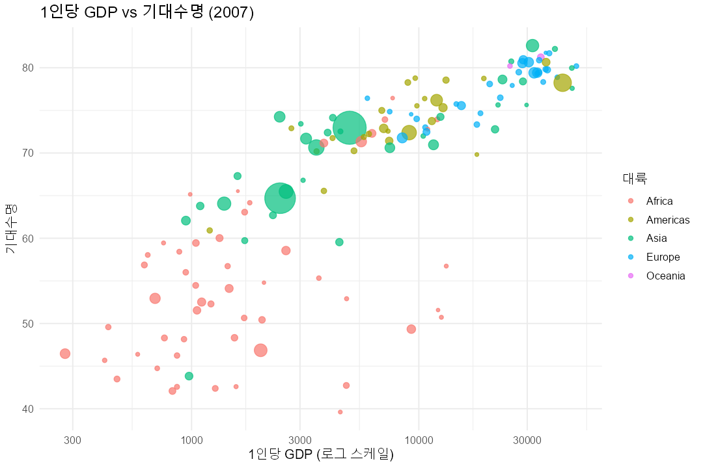

# Gapminder 데이터 분석 프로젝트

Gapminder 데이터셋(142개국 × 1952~2007년)을 **다운로드 → 품질 확인 → 정제 → 탐색적 분석(EDA)** 까지 수행하는 R 기반 분석 파이프라인입니다.

---

## 📁 프로젝트 구조

```
gapminder/
├── clean.R                       # 데이터 품질 확인 + 정제 스크립트
├── eda.R                         # 탐색적 데이터 분석 + 시각화 스크립트
├── README.md                     # (현재 문서)
├── data/
│   ├── gapminder.csv             # 원본 데이터 (다운로드)
│   ├── gapminder_clean.csv       # 정제본
│   └── quality_report.txt        # 품질 확인 텍스트 리포트
├── document/
│   ├── data_quality_report.md    # 품질 확인 보고서 (Markdown)
│   ├── eda_report.md             # EDA 보고서 (Markdown, 그림 포함)
│   └── eda_summary.txt           # EDA 요약 텍스트
└── figures/                      # EDA 시각화 8종 (PNG)
```

---

## 📊 데이터셋 개요

| 항목 | 내용 |
|---|---|
| 출처 | [plotly/datasets](https://github.com/plotly/datasets) (표준 Gapminder 5년 단위 데이터) |
| 규모 | 1,704행 × 6열 (142개국 × 12개 연도) |
| 기간 | 1952 ~ 2007 (5년 간격) |
| 컬럼 | `country`, `year`, `pop`, `continent`, `lifeExp`, `gdpPercap` |

---

## 🚀 실행 방법

> R 4.6.0 기준. `clean.R`은 base R만, `eda.R`은 `ggplot2`, `dplyr`, `tidyr`를 사용합니다.

```bash
# 1) 데이터 품질 확인 + 정제본 생성
Rscript clean.R

# 2) 탐색적 분석 + 시각화 생성
Rscript eda.R
```

Windows에서 `Rscript`가 PATH에 없을 경우:

```powershell
& "C:\Program Files\R\R-4.6.0\bin\Rscript.exe" clean.R
& "C:\Program Files\R\R-4.6.0\bin\Rscript.exe" eda.R
```

---

## ✅ 1단계 · 데이터 품질 확인

스크립트 `clean.R` → 보고서 [document/data_quality_report.md](document/data_quality_report.md)

**종합 판정: 통과 (PASS)**

| 점검 항목 | 결과 |
|---|---|
| 결측치(NA) | 0건 |
| 완전 중복 / 키 중복 | 0건 / 0건 |
| 도메인 규칙 (pop>0, lifeExp 0~120, gdpPercap>0) | 위반 없음 |
| 패널 균형 | 142개국 모두 12개 연도 → 균형 패널 |

→ 추가 정제 없이 분석에 바로 사용 가능한 깨끗한 데이터.

---

## 🔍 2단계 · 탐색적 분석 (EDA)

스크립트 `eda.R` → 보고서 [document/eda_report.md](document/eda_report.md)

### 핵심 인사이트

1. **소득과 건강의 강한 연관성** — 로그 1인당 GDP와 기대수명의 상관계수 **0.808** (원본 0.584).
2. **전반적 개선과 수렴** — 1952~2007 모든 대륙에서 기대수명 상승, 특히 **아시아 +24.4년**으로 빠른 추격.
3. **지속되는 지역 격차** — 2007년에도 **오세아니아(80.7) vs 아프리카(54.8)** 약 26년 격차.
4. **인구의 독립성** — 인구 규모는 기대수명·소득과 통계적으로 무관.

### 대표 시각화




> 전체 시각화 8종은 [figures/](figures/) 폴더 및 [EDA 보고서](document/eda_report.md)에서 확인할 수 있습니다.

---

## 🛠️ 기술 스택

- **언어**: R 4.6.0
- **패키지**: ggplot2, dplyr, tidyr (EDA) / base R (품질 확인)

---

## 📄 산출물 요약

| 분류 | 파일 |
|---|---|
| 스크립트 | `clean.R`, `eda.R` |
| 데이터 | `data/gapminder.csv`, `data/gapminder_clean.csv` |
| 보고서 (MD) | `document/data_quality_report.md`, `document/eda_report.md` |
| 리포트 (TXT) | `data/quality_report.txt`, `document/eda_summary.txt` |
| 시각화 | `figures/*.png` (8종) |
