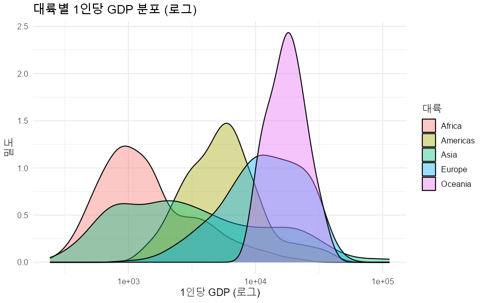
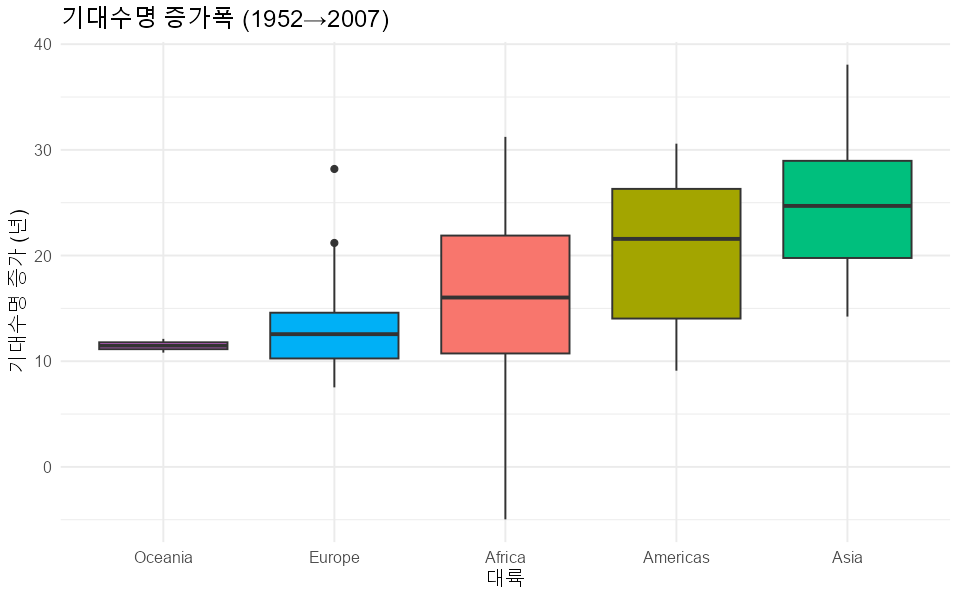

# Gapminder 탐색적 데이터 분석(EDA) 보고서

- **대상 파일**: `data/gapminder_clean.csv`
- **분석 스크립트**: `eda.R`
- **관측치**: 1,704행 / 142개국 / 1952~2007 (5년 간격, 12개 연도)
- **시각화**: `figures/` (8종)

---

## 1. 주요 변수 기술통계

| 변수 | 최소 | Q1 | 중앙값 | 평균 | Q3 | 최대 | 표준편차 |
|---|---|---|---|---|---|---|---|
| lifeExp (기대수명) | 23.6 | 48.2 | 60.7 | 59.5 | 70.8 | 82.6 | 12.9 |
| pop (인구) | 60,011 | 2.79M | 7.02M | 29.6M | 19.6M | 1,318.7M | 106.2M |
| gdpPercap (1인당 GDP) | 241.2 | 1,202.1 | 3,531.8 | 7,215.3 | 9,325.5 | 113,523.1 | 9,857.5 |

> 인구·GDP는 분포가 크게 우측으로 치우쳐 있어(평균 > 중앙값) 로그 스케일 분석이 유효합니다.

## 2. 대륙별 요약 (2007년 기준)

| 대륙 | 국가수 | 평균 기대수명 | 평균 1인당 GDP | 총인구 |
|---|---|---|---|---|
| Oceania | 2 | 80.7 | 29,810 | 24.5M |
| Europe | 30 | 77.6 | 25,054 | 586.1M |
| Americas | 25 | 73.6 | 11,003 | 898.9M |
| Asia | 33 | 70.7 | 12,473 | 3,812.0M |
| Africa | 52 | **54.8** | 3,089 | 929.5M |

- 2007년 기대수명 **최고 대륙: Oceania (80.7)**, **최저 대륙: Africa (54.8)** — 약 26년 격차
- 아시아는 총인구 38억 명으로 압도적 (전 세계 인구의 다수 차지)

## 3. 변수 간 상관관계

| | lifeExp | pop | gdpPercap |
|---|---|---|---|
| **lifeExp** | 1.000 | 0.065 | 0.584 |
| **pop** | 0.065 | 1.000 | -0.026 |
| **gdpPercap** | 0.584 | -0.026 | 1.000 |

- 1인당 GDP와 기대수명은 양의 상관(0.584).
- **로그 변환 시 상관계수 0.808로 강해짐** → 소득의 한계효용 체감(로그 관계)을 시사.
- 인구는 다른 변수와 사실상 무상관.

## 4. 시간에 따른 추이

대부분의 대륙에서 기대수명이 꾸준히 상승했으나, 아프리카는 1990년대 후반 정체 구간이 관찰됩니다(HIV/AIDS, 분쟁 등 영향).

전 세계 인구는 아시아를 중심으로 급격히 증가했습니다.

## 5. 기대수명 증가폭 (1952 → 2007)

| 대륙 | 평균 증가폭 |
|---|---|
| Asia | +24.4년 |
| Americas | +20.3년 |
| Africa | +15.7년 |
| Europe | +13.2년 |
| Oceania | +11.5년 |

- 출발선이 낮았던 **아시아의 증가폭이 가장 큼** → 선진 지역과의 **수렴(convergence)** 현상.
- 유럽·오세아니아는 이미 높은 수준이라 증가폭이 상대적으로 작음.

## 6. 기대수명 상·하위 국가 (2007년)

상위권은 일본·유럽·오세아니아 국가, 하위권은 사하라 이남 아프리카 국가가 차지합니다.

---

## 핵심 결론

1. **소득과 건강의 강한 연관성** — 로그 1인당 GDP와 기대수명의 상관 0.808. 경제 성장이 기대수명 향상의 핵심 동인.
2. **전반적 개선과 수렴** — 1952~2007 모든 대륙에서 기대수명 상승, 특히 아시아의 빠른 추격.
3. **지속되는 지역 격차** — 2007년에도 아프리카는 다른 대륙 대비 20년 이상 낮은 기대수명으로 격차가 잔존.
4. **인구의 독립성** — 인구 규모는 기대수명·소득 수준과 통계적으로 무관.

### 관련 산출물
- `figures/` — 시각화 8종
- `document/eda_summary.txt` — 텍스트 요약
- `eda.R` — 분석 스크립트
