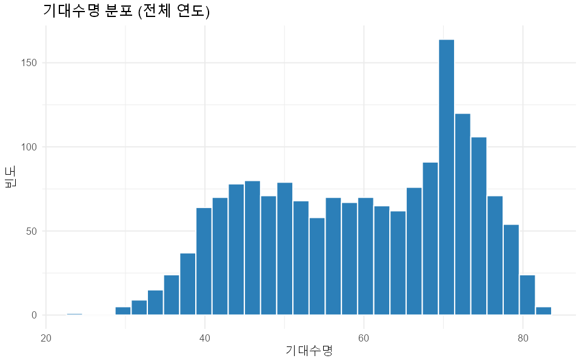
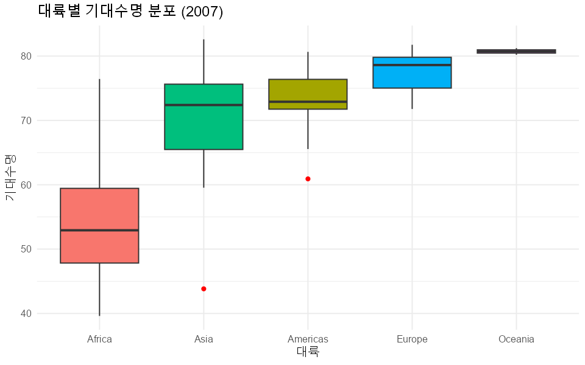
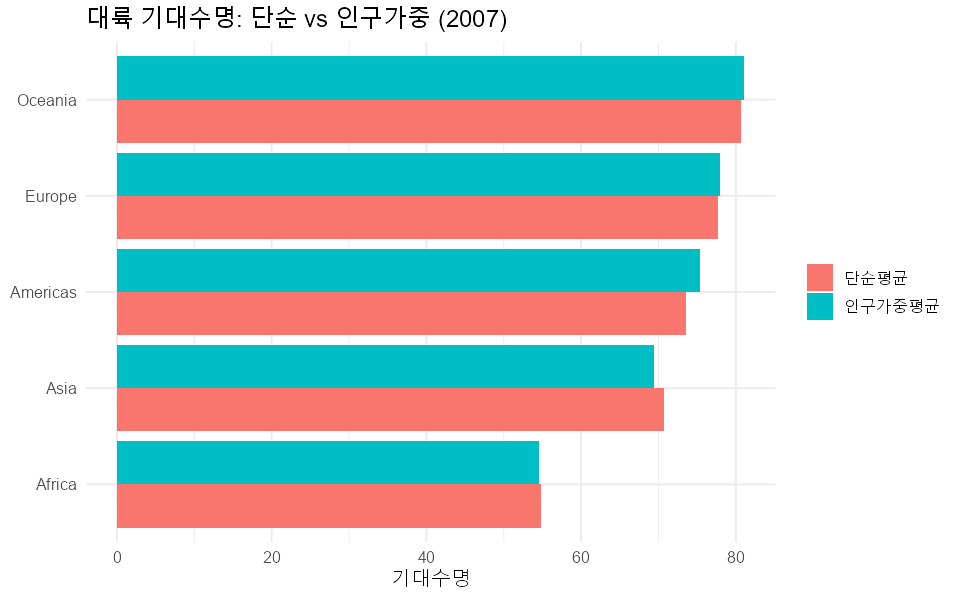
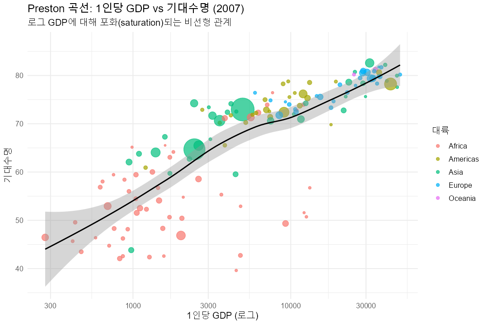
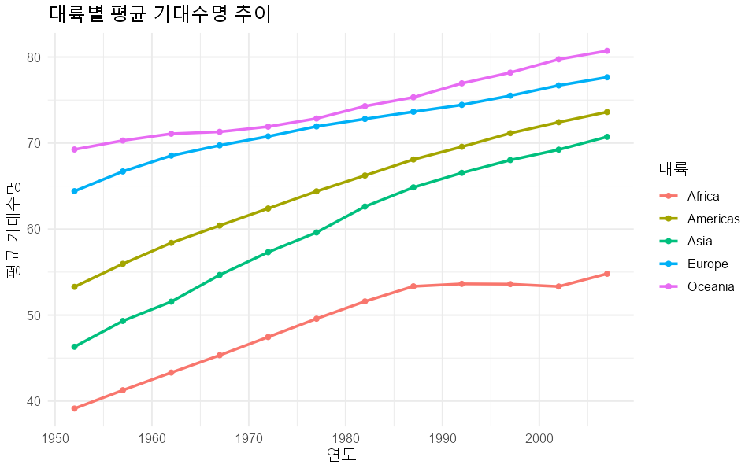
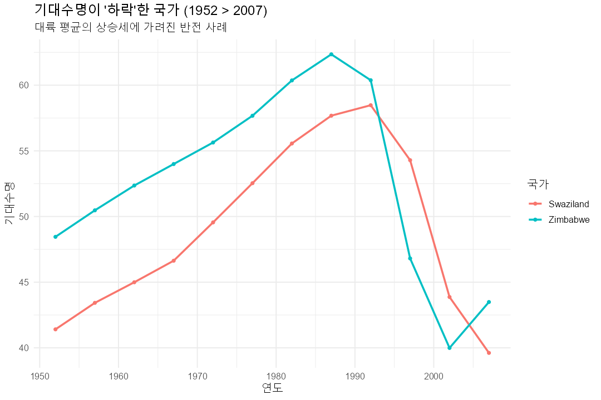
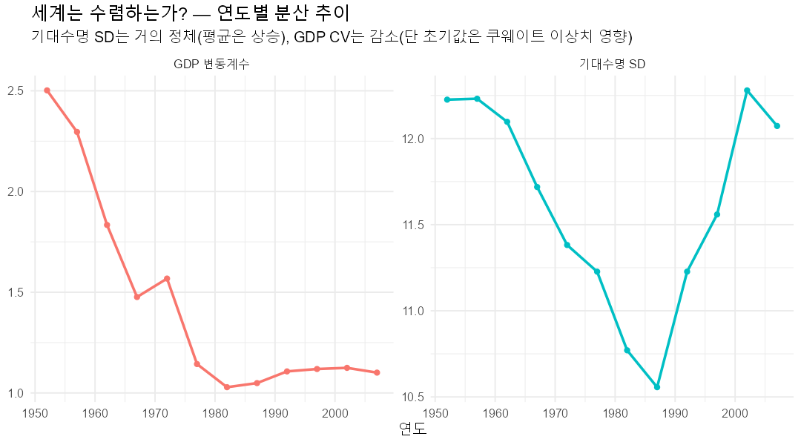
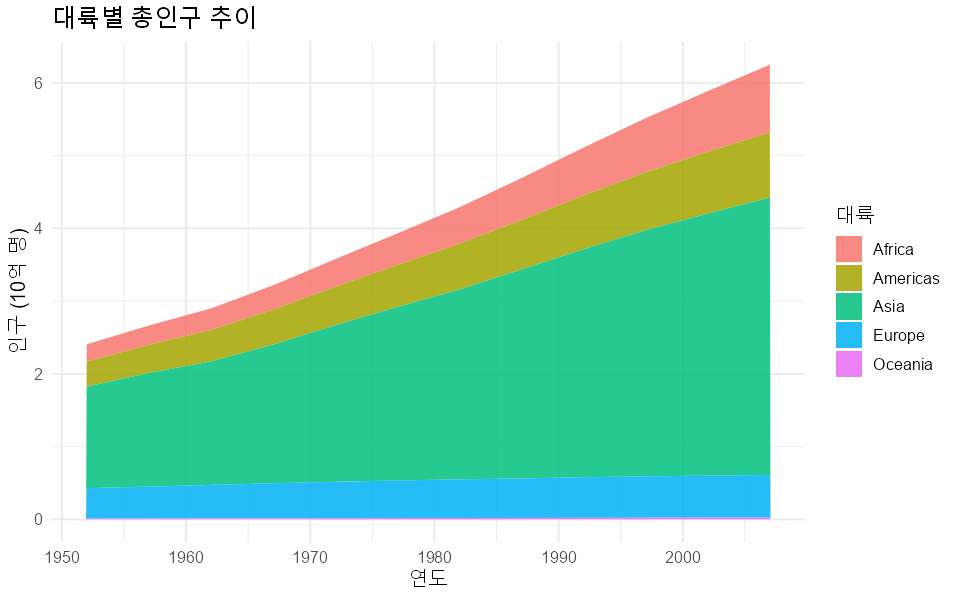
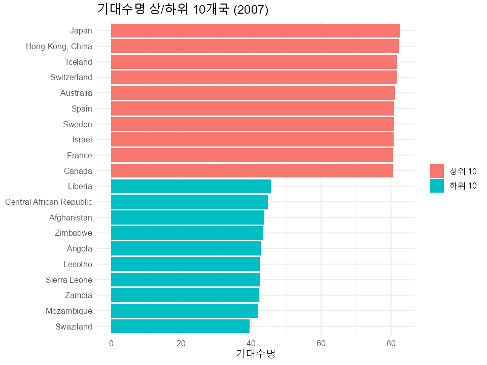

# Gapminder 탐색적 데이터 분석(EDA) 보고서 — 최종본

- **대상 파일**: `data/gapminder_clean.csv`
- **분석 스크립트**: `eda.R`
- **관측치**: 1,704행 / 142개국 / 1952~2007 (5년 간격, 12개 연도)
- **시각화**: `figures/` (9종)

> ⚠️ **분석 범위 주의**: 142개국만 포함(전 세계 아님), 5년 간격 패널.
> 모든 수치는 **기술적·상관적**이며 **인과 추론이 아닙니다.**

---

## 1. 기술통계 및 분포 형태

| 변수 | 중앙값 | 평균 | 표준편차 | 왜도(skewness) |
|---|---|---|---|---|
| lifeExp | 60.7 | 59.5 | 12.9 | -0.25 (대칭에 가까움) |
| pop | 7.02M | 29.6M | 106.2M | **8.33 (극단 우편향)** |
| gdpPercap | 3,531.8 | 7,215.3 | 9,857.5 | **3.84 (강한 우편향)** |

- pop·gdpPercap는 분포가 심하게 오른쪽으로 치우쳐, 산술평균이 대표값으로 부적절합니다.
- **GDP 산술평균 7,215 vs 기하평균 3,494 (약 3.6배 차이)** → 산술평균은 소수 부국에 끌려 과대평가됨.

## 2. 이상치(Outlier) 점검

1.5×IQR 규칙 기준 상한 초과: pop 208건, gdpPercap 143건 (우편향의 자연스러운 결과).

- **대표 이상치: Kuwait 1957년 1인당 GDP = 113,523** (산유국 anomaly).
- 이 값은 평균·상관·초기 분산 지표를 왜곡하므로 해석 시 유의해야 합니다.

## 3. 대륙 평균의 함정 — 단순평균 vs 인구가중평균 (2007)

대륙 평균을 단순평균으로 내면 인구 13억 중국과 소국을 동등 취급하게 됩니다. 실제 "사람 기준"인 **인구가중평균**을 함께 봐야 합니다.

| 대륙 | n | 단순평균 | 인구가중 | 차이 | 내부변동(CV) |
|---|---|---|---|---|---|
| Oceania | 2 | 80.7 | 81.1 | +0.3 | 0.009 |
| Europe | 30 | 77.6 | 77.9 | +0.2 | 0.038 |
| Americas | 25 | 73.6 | 75.4 | **+1.7** | 0.060 |
| Asia | 33 | 70.7 | **69.4** | **-1.3** | **0.113** |
| Africa | 52 | 54.8 | 54.6 | -0.2 | **0.176** |

- **아시아**는 가중 시 1.3년 *하락* → 인구 많은 국가들의 기대수명이 상대적으로 낮음.
- **아프리카·아시아의 내부변동(CV)이 커**, "대륙 평균" 하나로 요약하면 대표성이 약합니다(일본 vs 아프가니스탄).

## 4. 소득과 기대수명 — Preston 곡선

| 관계 | 상관계수 |
|---|---|
| lifeExp ~ gdpPercap (Pearson) | 0.584 |
| lifeExp ~ gdpPercap (**Spearman**) | **0.826** |
| lifeExp ~ log(gdpPercap) (Pearson) | **0.808** |

- 원시 Pearson(0.584)은 비선형성 때문에 관계를 **과소평가**합니다. 순위 기반 **Spearman 0.826**, 로그 변환 0.808로 보면 관계는 매우 강합니다.
- **고소득 구간에서 포화(saturation)** 되는 Preston 곡선 형태 → 소득이 낮을 때 추가 소득의 수명 효과가 크고, 부유해질수록 효과가 줄어듭니다.

**상관의 시간 안정성** (Simpson's paradox 점검): 전 기간을 합친 풀링 상관은 횡단면·시계열 변동이 섞일 위험이 있어, 연도별로 분리해 확인했습니다.

| 연도 | 1952 | 1962 | 1972 | 1982 | 1992 | 2002 | 2007 |
|---|---|---|---|---|---|---|---|
| lifeExp~log(GDP) 상관 | 0.75 | 0.77 | 0.79 | 0.85 | 0.86 | 0.83 | 0.81 |

→ 어느 연도에서 보든 0.75~0.87로 **안정적**. 풀링 상관이 허상이 아님을 확인.

## 5. "모든 대륙이 상승"의 착시 — 기대수명 하락 국가

대륙 평균 추이는 우상향하지만, **평균은 명백한 반전을 숨깁니다.**

**국가 단위 분석 결과:**

- **1952→2007 순(net) 하락 국가 2곳**: 짐바브웨(-5.0년), 스와질란드(-1.8년)
- **단일 5년 구간 최대 하락 TOP5**:

| 국가 | 최대 하락 | 배경(추정) |
|---|---|---|
| Rwanda | **-20.4년** | 1994년 집단학살 |
| Zimbabwe | -13.6년 | HIV/AIDS·경제붕괴 |
| Lesotho | -11.0년 | HIV/AIDS |
| Swaziland | -10.4년 | HIV/AIDS |
| Botswana | -10.2년 | HIV/AIDS |

→ 52개국이 최소 한 번은 5년 새 기대수명 하락을 경험. **대륙·세계 평균만 보면 이 비극이 보이지 않습니다.**

## 6. 세계는 수렴하는가? — 분산 추이

| 지표 | 1952 | 2007 | 해석 |
|---|---|---|---|
| 기대수명 표준편차 | 12.2 | 12.1 | **거의 정체** |
| GDP 변동계수(CV) | 2.50 | 1.10 | 감소 |

- 평균 기대수명은 크게 올랐지만 **국가 간 분산(SD)은 거의 변하지 않았습니다.** 상단이 포화되는 동안 아프리카 반전이 하단을 벌렸기 때문 → "수렴"으로 단정 불가.
- GDP CV는 감소했으나, **1952년 값(2.50)이 쿠웨이트 이상치로 부풀려진** 점을 감안하면 "소득 수렴/발산"을 단정하기 어렵습니다.

## 7. 인구 추이 및 상·하위 국가

전 세계 인구 증가는 아시아가 주도. 2007년 기대수명 상위권은 일본·유럽·오세아니아, 하위권은 사하라 이남 아프리카가 차지합니다.

---

## 핵심 결론

1. **소득–건강의 강한 비선형 관계** — Spearman 0.826, 로그 GDP 상관 0.808. 저소득 구간 효과가 크고 고소득 구간 포화(Preston 곡선). 연도별로도 안정적.
2. **평균은 위험하다** — "모든 대륙 상승"은 착시. 짐바브웨·르완다 등에서 기대수명이 실제로 급락. 대륙 평균은 인구가중 시 해석이 달라지고(아시아 -1.3년), 내부 이질성도 큼.
3. **수렴은 단정 불가** — 기대수명 분산은 정체, GDP CV 감소는 이상치 영향. 분배·국가 내 불평등은 1인당 지표로 측정 불가.

## 분석의 한계 (Limitations)

- 142개국·5년 간격 → **전수·연속 데이터 아님** (생존편향 가능).
- 모든 통계는 **기술적·상관적**이며 인과가 아님.
- 대륙 평균은 **가중 방식에 따라 결론이 달라짐**.
- 1인당 GDP는 평균값 → **국가 내 소득 불평등 미반영**.

### 관련 산출물
- `figures/` — 시각화 9종
- `document/eda_summary.txt` — 텍스트 요약
- `eda.R` — 분석 스크립트(최종본)
